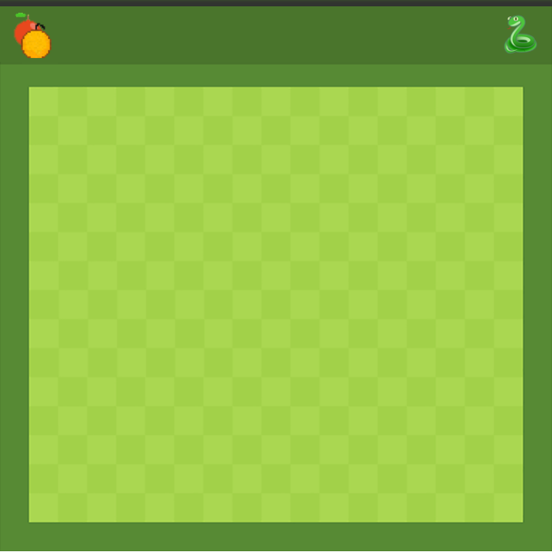

# Snake Game


> Snake game in javascript where you can eat two type of apples with different points. 





## Table of Contents

- [Background](#background)
- [Install](#install)
- [Maintainers](#maintainers)
- [License](#license)

## Background

The background of the project is based on CodeExample images, the code is based on his script to resolve some problems during the coding time.

## Install

Pull the repository using GitHub Desktop or other tools for GitHub.

The game didn't need to install the software. To run the game, you need to go in the directory of the project and digit the follow command:

```sh
$ open index.html
```

## Maintainers

[@k0d3t](https://github.com/K0D3T).


## License

[MIT](LICENSE) © Mario Sessa
